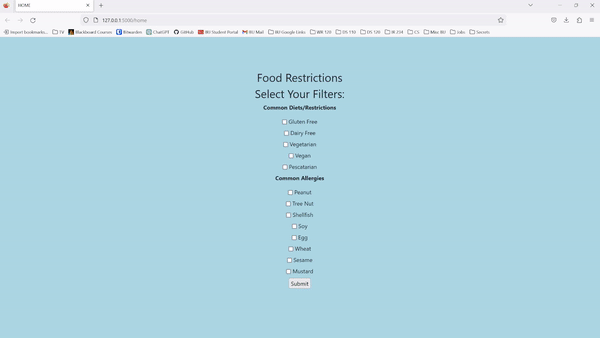

# BUDining
My attempt to improve the BU Dining Hall website for people like myself with dietary restrictions

## NOW HOSTED AT [budining.samcowan.net](budining.samcowan.net)

## Features
- Users can select dietary restrictions and allergens to avoid
- The site returns the daily menu at Warren, West, Marciano, and Granby Dining Halls (sorry Fenway users)
- Daily menu data is stored on Firebase
- Click on menu items to view its ingredient list

## Launch
If you want to run this locally, you can clone the repo and do the following:
`python3 main.py`  
Navigate to `http://127.0.0.1:5000/home` or `http://127.0.0.1:5000/`

Select your dietary restrictions and submit the form.  
  
Updating Firebase each day takes ~30 seconds, so if you are the first user of the day you will experience a significant delay  
  
**Big Disclaimer**: 
- BU's menu data is not always accurate, and its ingredients lists often seem unlikely or incorrect.
- Additionally, my basic filters don't catch unusual ingredient items, so make sure to check ingredients or ask someone if something is listed that seems suspicious

## Preview

